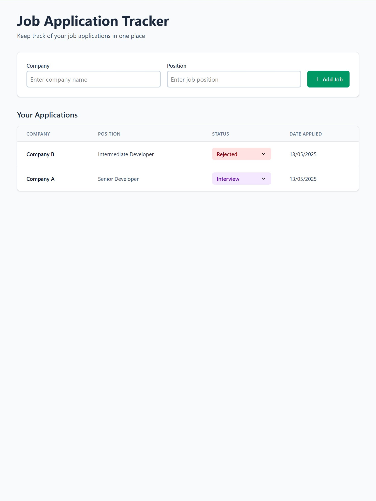

# Job Application Tracker

Two small projects that work together:

| Folder             | Tech                         | Purpose                             |
| ------------------ | ---------------------------- | ----------------------------------- |
| **JobTracker.Api** | ASP-NET Core 8 + EF Core     | REST API + in-memory (or SQLite) DB |
| **job-tracker-ui** | React 18 + Vite + TypeScript | Single-page front-end               |

---

## Demo

### Quick peek

| Initial load                           | After adding a couple of applications |
| -------------------------------------- | ------------------------------------- |
|  |    |

### Walk-through video

<video src="demo/demo.mp4" controls width="700"></video>

---

## Prerequisites

- **.NET 8 SDK** – <https://dotnet.microsoft.com/download>
- **Node 18+ / npm 9+** – <https://nodejs.org>

---

## 1 Clone & restore

```bash
git clone https://github.com/VarinderS/job-tracker job-tracker
cd job-tracker
```

The .gitignore keeps `bin/`, `obj/`, `node_modules/` etc. out of the repo.

## 2 Run the API

```bash
cd job-tracker-api
dotnet restore        # pulls NuGet packages
dotnet run            # http://localhost:5128
```

Uses EF-Core InMemory provider by default – data resets on restart.

## 3 Run the front-end

```bash
cd job-tracker-ui
npm install
npm run dev # http://localhost:5173
```

## 4 Explore the API

_Swagger UI_
http://localhost:5128/swagger

## Folder map (top-level)

```
job-tracker/
├─ JobTracker.Api/ # ASP-NET Core solution
│  └─ ...
├─ job-tracker-ui/ # React/Vite SPA
│  └─ ...
└─ README.md # you are here
```

## Troubleshooting

| Symptom                       | Fix                                                                        |
| ----------------------------- | -------------------------------------------------------------------------- |
| **CORS 403 when calling API** | Ensure `UseCors("FrontendDev")` is above `MapControllers` in `Program.cs`. |
| **HTTPS certificate warning** | Run `dotnet dev-certs https --trust` once.                                 |
| **Port clash**                | Edit `launchSettings.json` (API) or pass `--port` to `npm run dev`.        |
